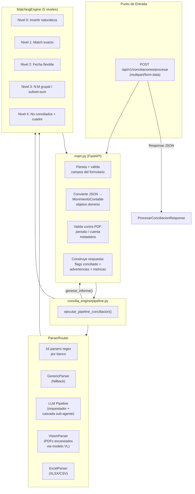

# Conciliación Bancaria Simplificada


**Microservicio independiente de conciliación bancaria** — un solo endpoint público, sin base de datos, sin autenticación, sin Celery. Procesa extractos bancarios PDF y los concilia contra registros contables en una sola llamada.

---

## Tabla de Contenidos

- [Características](#características)
- [Stack Tecnológico](#stack-tecnológico)
- [Inicio Rápido](#inicio-rápido)
- [Docker](#docker)
- [Referencia de la API](#referencia-de-la-api)
- [Validación](#validación)
- [Arquitectura](#arquitectura)
- [Estructura del Proyecto](#estructura-del-proyecto)
- [PDFs de Prueba](#pdfs-de-prueba)
- [Testing](#testing)
- [Mantenimiento](#mantenimiento)
- [Licencia](#licencia)
- [Contribuir](#contribuir)
- [Seguridad](#seguridad)

---

## Características

- **Endpoint público único** — `POST /api/v1/conciliaciones/procesar`, sin autenticación
- **16 parsers bancarios especializados** — extracción con regex para bancos colombianos (BBVA, Davivienda, Bancolombia, Bogotá, Occidente, Itaú, Colpatria, Serfinanza, Banco GNB, Banco Popular, Bancoomeva, AV Villas, Banco Caja Social, Banco Agrario, Davibanck, FIC)
- **Cascada LLM como fallback** — cuando los parsers regex fallan, una cascada basada en LiteLLM (Orquestador → Sub-agente → VisionParser) maneja PDFs complejos o escaneados
- **VisionParser** — PyMuPDF renderiza PDFs escaneados/solo-imagen a PNG y los procesa con modelos VL
- **Motor de matching de 5 niveles** — Inversión de naturaleza → Exacto → Fecha flexible → N:M grupal/subset-sum → Clasificación no conciliados + cuadre
- **Sin base de datos** — puramente síncrono, sin persistencia
- **Doble extracción de texto** — pdfplumber (rápido, preserva layout) + MarkItDown (optimizado para LLM)
- **Errores estructurados** — códigos de error estandarizados para PDFs vacíos/corruptos/encriptados/solo-imagen/no-extracto

---

## Stack Tecnológico

| Capa | Tecnología |
|------|------------|
| Framework | FastAPI 0.115+ |
| Servidor ASGI | Uvicorn 0.32+ |
| Validación | Pydantic v2 |
| Extracción de texto PDF | pdfplumber, pypdf, MarkItDown |
| Modelos LLM / VL | LiteLLM (NVIDIA NIM, Hugging Face, Gemini) |
| Renderizado de imágenes | PyMuPDF (fitz) |
| Contenedores | Docker (python:3.12-slim) |
| Testing | pytest, httpx (ASGITransport), Hypothesis |

---

## Inicio Rápido

### Requisitos previos

- Python 3.12+
- (Opcional) API keys para funciones LLM: `LLM_API_KEY`, `NVIDIA_API_KEY`, `HF_API_KEY`

### Instalación

```bash
git clone <repo-url>
cd simplificada-conciliacion-bancaria
pip install -r requirements.txt
```

### Entorno

Copia el ejemplo y completa tus keys:

```bash
cp .env.example .env
```

### Ejecutar

```bash
uvicorn main:app --host 0.0.0.0 --port 8000
```

Abre http://localhost:8000/docs para la interfaz Swagger.

### Probar con curl

```bash
curl -X POST http://localhost:8000/api/v1/conciliaciones/procesar \
  -F "extracto=@/path/to/extracto.pdf" \
  -F 'movimientos_detalle=[{"fecha":"01-03-2026","codigo_movimiento":"TRX001","debito":0,"credito":250000,"saldo":1750000,"conciliado":false}]'
```

---

## Docker

### Requisitos

- Docker Desktop instalado y corriendo.

### 1. Construir la imagen (primera vez, o después de cambios en el código)

```bash
docker build -t procesar-api .
```

### 2. Iniciar el contenedor

```bash
docker run -d --name procesar-api -p 8000:8000 procesar-api
```

La API queda disponible en http://localhost:8000/docs

### 3. Verificar que está corriendo

```bash
docker ps
```

Debe aparecer `procesar-api` con estado `Up`.

### 4. Probar con un extracto real

```bash
curl -X POST http://localhost:8000/api/v1/conciliaciones/procesar \
  -F "extracto=@/ruta/al/extracto.pdf" \
  -F 'movimientos_detalle=[{"fecha":"01-03-2026","codigo_movimiento":"TRX001","debito":0,"credito":250000,"saldo":1750000,"conciliado":false}]'
```

### 5. Ver logs (para depurar errores)

```bash
docker logs procesar-api
```

### 6. Detener el contenedor

```bash
docker stop procesar-api
```

### 7. Reconstruir después de cambios

```bash
docker stop procesar-api && docker rm procesar-api
docker build -t procesar-api .
docker run -d --name procesar-api -p 8000:8000 procesar-api
```

### 8. Ejecutar tests unitarios

```bash
docker exec procesar-api pytest tests/ -v -q
```

### Solución de problemas

```bash
# ¿Qué contenedores están corriendo?
docker ps

# ¿El puerto 8000 ya está ocupado?
netstat -ano | findstr :8000    # Windows
lsof -i :8000                   # Mac / Linux

# Error "port is already allocated" → usar otro puerto:
docker run -d --name procesar-api -p 8001:8000 procesar-api
# La API queda en http://localhost:8001/docs
```

La imagen usa un **usuario no-root** (`appuser`) y ejecuta `apt-get upgrade` durante el build para parchear CVEs.

---

## Despliegue en Servidor (con OPA)

Si el servidor tiene habilitado el plugin `opa-docker-authz`, las imágenes deben usar el namespace `infortributos/`. Además, las API keys **no** se incluyen en la imagen Docker por seguridad — se inyectan como variables de entorno en tiempo de ejecución.

### 1. Clonar el repo

```bash
git clone https://github.com/InforTributos/simplificado-conciliacion-bancaria.git
cd simplificado-conciliacion-bancaria
```

### 2. Build de la imagen

```bash
DOCKER_BUILDKIT=0 docker build --no-cache -t procesar-api .
```

### 3. Taggear con namespace de infra

```bash
docker tag procesar-api infortributos/procesar-api:latest
```

### 4. Ejecutar inyectando variables

```bash
docker run -d --name procesar-api -p 8000:8000 \
  -e MAX_FILE_SIZE_MB=50 \
  -e LLM_API_KEY=tu-api-key \
  -e NVIDIA_API_KEY=tu-api-key \
  infortributos/procesar-api:latest
```

### 5. Verificar

```bash
docker ps
curl http://localhost:8000/docs
```

### 6. Ver logs

```bash
docker logs procesar-api
```

### 7. Reconstruir después de cambios

```bash
docker stop procesar-api && docker rm procesar-api
DOCKER_BUILDKIT=0 docker build --no-cache -t procesar-api .
docker tag procesar-api infortributos/procesar-api:latest
docker run -d --name procesar-api -p 8000:8000 \
  -e MAX_FILE_SIZE_MB=50 \
  -e LLM_API_KEY=tu-api-key \
  -e NVIDIA_API_KEY=tu-api-key \
  infortributos/procesar-api:latest
```

---

## Referencia de la API

### `POST /api/v1/conciliaciones/procesar`

Endpoint público. No requiere autenticación.

**Content-Type:** `multipart/form-data`

#### Campos de la Solicitud

| Campo | Tipo | Requerido | Descripción |
|-------|------|-----------|-------------|
| `extracto` | archivo (PDF) | **Sí** | Extracto bancario PDF (tamaño máximo configurable vía `MAX_FILE_SIZE_MB`) |
| `movimientos_detalle` | string (JSON) | **Sí** | Array JSON de movimientos contables (ver esquema abajo) |
| `periodo` | string | No | Período esperado en formato `AAAAMM` (ej. `202401`). Si se omite, se auto-detecta del PDF. |
| `cuenta_bancaria` | string (JSON) | No | JSON con metadatos de la cuenta (`{"numero_cuenta": "123456789"}`). Si se provee, se valida contra el PDF. |

#### Esquema de Movimiento

```json
[
  {
    "fecha": "01-03-2026",
    "codigo_movimiento": "TRX001",
    "debito": 0,
    "credito": 250000,
    "saldo": 1750000,
    "conciliado": false
  }
]
```

| Campo | Tipo | Requerido | Notas |
|-------|------|-----------|-------|
| `fecha` | string | **Sí** | Formato: `dd-mm-aaaa` (ej. `01-03-2026`) |
| `codigo_movimiento` | string | No | Código interno del movimiento (se usa como referencia, no para matching) |
| `debito` | number | **Sí*** | Monto del débito. Debe ser > 0 si credito = 0 |
| `credito` | number | **Sí*** | Monto del crédito. Debe ser > 0 si debito = 0 |
| `saldo` | number | No | Saldo corriente (se usa como señal secundaria de matching) |
| `conciliado` | boolean | No | Estado inicial — siempre `false`. Se actualiza por el motor |

> *Uno de `debito` o `credito` debe ser > 0. Las filas donde ambos son 0 se omiten.

#### Esquema de Respuesta

```json
{
  "estado": "completada",
  "periodo": "202603",
  "resumen": {
    "total_movimientos": 1852,
    "conciliados": 1820,
    "no_conciliados": 32,
    "porcentaje_conciliacion": 98.27
  },
  "cuadre_diferencia": 0.0,
  "movimientos_detalle": [
    {
      "fecha": "01-03-2026",
      "codigo_movimiento": "TRX001",
      "debito": 0,
      "credito": 250000,
      "saldo": 1750000,
      "conciliado": true
    }
  ],
  "advertencias": [],
  "metricas": {
    "tiempo_total_ms": 1234
  }
}
```

| Campo | Tipo | Descripción |
|-------|------|-------------|
| `estado` | `"completada"` \| `"no_completada"` \| `"error"` | Estado de la conciliación |
| `periodo` | string \| null | Período detectado (AAAAMM) |
| `resumen` | object | Totales: movimientos, conciliados por nivel, %, no conciliados |
| `cuadre_diferencia` | float \| null | Diferencia de cuadre ($0 = cuadra) |
| `movimientos_detalle` | array \| null | Mismo array de la solicitud con `conciliado: true/false` agregado |
| `advertencias` | array | Advertencias no bloqueantes (ej. diferencia de saldos). Siempre presente, incluso vacío. |
| `metricas` | object \| null | Tiempo de procesamiento, parser usado, versión del motor |

#### Códigos de Error

| HTTP Status | `error.codigo` | Significado |
|-------------|----------------|-------------|
| 200 | — | Éxito con `estado: "completada"` o `"no_completada"` |
| 200 | `VALIDACION_ERROR` | Fallo en parsing (`estado: "error"` con detalles) |
| 400 | `ARCHIVO_MUY_GRANDE` | PDF excede `MAX_FILE_SIZE_MB` |
| 422 | — | JSON inválido, movimientos vacíos, formato de fecha incorrecto |
| 422 | `VALIDACION_PERIODO` | Período del usuario no coincide con el rango del PDF |
| 422 | `VALIDACION_CUENTA` | Cuenta del usuario no coincide con la del PDF |
| 500 | `ERROR_INTERNO` | Error inesperado del servidor |

---

## Validación

### Validación de Período (bloqueante)

Si se provee `periodo` (AAAAMM), se valida contra el rango de fechas extraído del PDF. Se retorna 422 si no hay solapamiento. Esta validación se omite cuando el parser usa `date.today()` como fallback (no se encontró fecha en el PDF).

### Validación de Cuenta (bloqueante)

Si se provee `cuenta_bancaria.numero_cuenta`, se compara con el número de cuenta extraído del PDF. Para Banco Caja Social (cuentas parcialmente enmascaradas), solo se validan los últimos 4 dígitos.

### Advertencias de Saldo (no bloqueantes)

Si se proveen `saldo_anterior` y/o `saldo_final` en `cuenta_bancaria`, se comparan contra el PDF. Las diferencias se reportan en `advertencias` pero no bloquean la solicitud.

---

## Arquitectura



> Para la lógica de negocio detallada de cada nivel de matching (fórmulas de confianza, algoritmo subset-sum, fórmula de cuadre), ver [docs/MATCHING_LOGICA.md](docs/MATCHING_LOGICA.md).

---

## Estructura del Proyecto

```
simplificada-conciliacion-bancaria/
├── main.py                          # App FastAPI — endpoint POST único
├── requirements.txt                 # 7 dependencias core + 4 opcionales
├── Dockerfile                       # Non-root, health check, CVEs parcheados
├── .env.example                     # Plantilla — 4 variables de entorno
├── pyproject.toml                   # Configuración de pytest
│
├── concilia_engine/                 # Motor de conciliación bancaria compartido
│   ├── config.py                    # MatchConfig, ParseConfig, LLMConfig
│   ├── models.py                    # Dataclasses de dominio (sin DB)
│   ├── normalizer.py                # Utilitarios de fecha/monto/descripción/cuenta
│   ├── pipeline.py                  # ejecutar_pipeline_conciliacion()
│   ├── report.py                    # generar_informe() reporte JSON
│   ├── validacion.py                # Validación cruzada de período y cuenta
│   │
│   ├── matching/                    # Motor de conciliación en 5 niveles
│   │   ├── engine.py                # Orquestador (niveles 0-4)
│   │   ├── nivel0.py                # Inversión de naturaleza
│   │   ├── nivel1.py                # Match exacto (fecha/monto/naturaleza)
│   │   ├── nivel2.py                # Match con fecha flexible
│   │   ├── nivel3.py                # Match grupal N:M / subset-sum
│   │   └── nivel4.py                # Clasificación no conciliados + cuadre
│   │
│   ├── parsers/                     # 16 bancos + genérico + LLM + Vision + Excel
│   │   ├── base.py                  # BankParser ABC
│   │   ├── router.py                # ParserRouter — detección y despacho
│   │   ├── generic.py               # Fallback universal con regex
│   │   ├── excel.py                 # Archivos contables XLSX/XLS/CSV
│   │   ├── llm.py                   # Cascada LLM legacy
│   │   ├── llm_orchestrator.py      # Analizador de formato LLM
│   │   ├── llm_subagent.py          # Extracción LLM con prompts por banco
│   │   ├── llm_provider.py          # LiteLLM con retry/backoff
│   │   ├── markitdown_converter.py  # Conversor MarkItDown PDF→markdown
│   │   ├── vision_parser.py         # Modelo VL para PDFs escaneados
│   │   ├── bbva.py                  # BBVA — naturaleza por dirección del saldo
│   │   ├── davivienda.py            # Davivienda — formato DD MM $monto
│   │   ├── bancolombia.py           # Bancolombia — DD/MM DESC SUCURSAL
│   │   ├── bogota.py                # Banco de Bogotá — 950 movs validados
│   │   ├── occidente.py             # Occidente — columnas DEBITOS/CREDITOS
│   │   ├── itau.py                  # Itaú — naturaleza por dirección del saldo
│   │   ├── colpatria.py             # Colpatria — naturaleza por signo
│   │   ├── serfinanza.py            # Serfinanza — DD/MM/YYYY
│   │   ├── banco_gnb.py             # Banco GNB — MM/DD, NC=crédito
│   │   ├── banco_popular.py         # Banco Popular — layout máquina de escribir
│   │   ├── bancoomeva.py             # Bancoomeva — $DEBITO $CREDITO
│   │   ├── avvillas.py              # AV Villas — deduplicación de caracteres
│   │   ├── banco_caja_social.py     # Banco Caja Social — cuenta enmascarada
│   │   ├── banco_agrario.py         # Banco Agrario — solo resumen
│   │   ├── davibanck.py             # Davibanck — AHORROS ESPECIALES
│   │   └── fic.py                   # FIC — naturaleza ADICIÓN/RETIRO
│   │
│   ├── prompts/                     # Prompts YAML para sub-agente LLM
│   │   ├── registry.yaml            # Mapeo banco → prompt
│   │   ├── generic.yaml             # Prompt genérico de fallback
│   │   └── *.yaml                   # 9 plantillas específicas por banco
│   │
│   └── utils/
│       └── llm_helpers.py           # clean_and_parse_llm_json()
│
├── tests/
│   ├── conftest.py                  # Fixtures (client, mock_pipeline)
│   ├── test_procesar.py             # 18 tests unitarios (mock pipeline)
│   └── e2e/
│       └── test_e2e_procesar.py     # 5 tests E2E (servidor real)
│
├── LICENSE                          # MIT
├── README.md                        # Este archivo (inglés)
├── README.es.md                     # Versión en español
├── SECURITY.md                      # Política de seguridad
├── CONTRIBUTING.md                  # Guía de contribución
├── MAINTENANCE.md                   # Guía de mantenimiento
├── AGENTS.md                        # Instrucciones para agentes IA (opencode)
└── CLAUDE.md                        # Instrucciones para agentes IA (Claude Code)
```

---

## PDFs de Prueba

El proyecto padre (`conciliacion-bancaria`) incluye **23 extractos bancarios reales en PDF** para probar los parsers. Se encuentran en:

```
conciliacion-bancaria/tests/fixtures/reales/extractosBancarios/
```

| # | Archivo | Banco | Movs | Parser | Notas |
|---|---------|------|------|--------|-------|
| 1 | `bbva.pdf` | BBVA | 28 | `bbva.py` | Naturaleza por dirección del saldo |
| 2 | `bbva2.pdf` | BBVA | — | VisionParser | PDF escaneado/solo-imagen |
| 3 | `davivienda.pdf` | Davivienda | 327 | `davivienda.py` | Formato DD MM `$XX,XXX.XX+` |
| 4 | `davivienda2.pdf` | Davivienda | — | `davivienda.py` | Segunda variante |
| 5 | `BANCOLOMBIA.pdf` | Bancolombia | 42 | `bancolombia.py` | DD/MM DESC SUCURSAL DCTO VALOR SALDO |
| 6 | `bancoDeBogota.pdf` | Banco de Bogotá | 950 | `bogota.py` | Incluye Fiduoccidente; naturaleza por saldo |
| 7 | `bancoDeBogota2.pdf` | Banco de Bogotá | 3 | `bogota.py` | Extracto corto, 3 movimientos |
| 8 | `occidente.pdf` | Occidente | 30 | `occidente.py` | DD/MM CODE DESC CIUDAD DOC MONTO SALDO |
| 9 | `occidente2.pdf` | Occidente (Fiduciaria) | 31 | `occidente.py` | Mismo formato, variante fiduciaria |
| 10 | `SERFINANZA.pdf` | Serfinanza | 2 | `serfinanza.py` | DD/MM/YYYY DESC SUCURSAL VALOR SALDO |
| 11 | `bancoGNB.pdf` | Banco GNB | 35 | `banco_gnb.py` | Formato MM/DD, NC = crédito |
| 12 | `bancoPopular.pdf` | Banco Popular | 35 | `banco_popular.py` | Layout máquina de escribir, decimal separado por espacio |
| 13 | `bancoPopular2.pdf` | Banco Popular | — | VisionParser | PDF escaneado/solo-imagen |
| 14 | `bancoomeva.pdf` | Bancoomeva | 21 | `bancoomeva.py` | Columnas `$DEBITO` / `$CREDITO` |
| 15 | `avVillas.pdf` | AV Villas | 1 | `avvillas.py` | Deduplicación de caracteres duplicados |
| 16 | `FONDO DE INVERSIÓN COLECTIVA.pdf` | FIC | 62 | `fic.py` | Naturaleza ADICIÓN / RETIRO |
| 17 | `colpatria.pdf` | Colpatria | 23 | `colpatria.py` | Montos formato CO, naturaleza por signo |
| 18 | `bancoCajaSocial.pdf` | Banco Caja Social | 1 | `banco_caja_social.py` | Formato MMM DD, cuenta enmascarada |
| 19 | `itau.pdf` | Itaú | 55 | `itau.py` | Fecha solo día, naturaleza por saldo |
| 20 | `davibanck.pdf` | Davibanck | 0 | `davibanck.py` | AHORROS ESPECIALES, solo saldos |
| 21 | `davibanck2.pdf` | Davibanck | — | `davibanck.py` | Segunda variante |
| 22 | `bancoAgrario.pdf` | Banco Agrario | 0 | `banco_agrario.py` | Cuenta corriente, solo saldos |
| 23 | `bancoAgrario2.pdf` | Banco Agrario | — | `banco_agrario.py` | Segunda variante |

**Nota:** Los PDFs marcados con `VisionParser` requieren `NVIDIA_API_KEY` en `.env` para procesarse (son PDFs escaneados/solo-imagen).

Para usar estos PDFs en pruebas en este proyecto, cópialos del repo padre:

```bash
mkdir -p tests/fixtures/reales/extractosBancarios
cp ../conciliacion-bancaria/tests/fixtures/reales/extractosBancarios/*.pdf tests/fixtures/reales/extractosBancarios/
```

---

## Testing

### Tests Unitarios (pipeline mockeado)

```bash
pytest tests/ -q
```

**23 tests en total:**
- 18 tests unitarios (`tests/test_procesar.py`) — pipeline mockeado, cubren todos los caminos
- 5 tests E2E (`tests/e2e/test_e2e_procesar.py`) — servidor uvicorn real en puerto 8002

### Ejecutar con cobertura

```bash
pip install pytest-cov
pytest tests/ --cov=main --cov=concilia_engine --cov-report=html
```

---

## Mantenimiento

Para instrucciones completas de mantenimiento (actualizar parsers, sincronizar engine, PDFs de prueba), consulta [MAINTENANCE.md](MAINTENANCE.md).

Resumen rápido:
- `concilia_engine/` es una **copia** del proyecto padre — **no** se edita aquí
- Para actualizar el engine, copia desde `conciliacion-bancaria/concilia_engine/`
- Los cambios en parsers deben hacerse primero en el proyecto padre, luego copiarse
- Después de cualquier copia del engine, ejecuta `pytest tests/ -q` para verificar que no haya regresiones

---

## Licencia

Este proyecto está licenciado bajo la Licencia MIT. Consulta [LICENSE](LICENSE) para más detalles.

---

## Contribuir

Consulta [CONTRIBUTING.md](CONTRIBUTING.md) para las guías de contribución.

---

## Seguridad

Consulta [SECURITY.md](SECURITY.md) para nuestra política de seguridad y proceso de reporte de vulnerabilidades.
