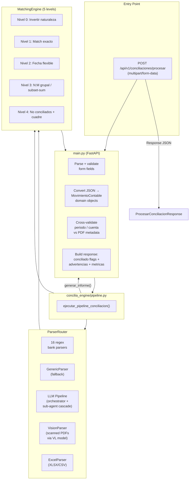

# Simplicado Conciliación Bancaria


**Standalone bank reconciliation microservice** — single public endpoint, no database, no authentication, no Celery. Parse bank PDF statements and match them against accounting records in one call.

---

## Table of Contents

- [Features](#features)
- [Tech Stack](#tech-stack)
- [Quick Start](#quick-start)
- [Docker](#docker)
- [API Reference](#api-reference)
- [Validation](#validation)
- [Architecture](#architecture)
- [Project Structure](#project-structure)
- [Test PDFs](#test-pdfs)
- [Testing](#testing)
- [Maintenance](#maintenance)
- [License](#license)
- [Contributing](#contributing)
- [Security](#security)

---

## Features

- **Single public endpoint** — `POST /api/v1/conciliaciones/procesar`, no auth required
- **16 specialized bank parsers** — regex-based extraction for Colombian banks (BBVA, Davivienda, Bancolombia, Bogotá, Occidente, Itaú, Colpatria, Serfinanza, Banco GNB, Banco Popular, Bancoomeva, AV Villas, Banco Caja Social, Banco Agrario, Davibanck, FIC)
- **LLM cascade fallback** — when regex parsers fail, LiteLLM-based cascade (Orchestrator → Sub-agent → VisionParser) handles complex or scanned PDFs
- **VisionParser** — PyMuPDF renders scanned/image-only PDFs to PNG and processes them via VL models
- **5-level matching engine** — Nature inversion → Exact match → Flexible date → N:M group/subset-sum → Unmatched classification + cuadre
- **No database** — purely synchronous, no persistence
- **Dual text extraction** — pdfplumber (fast, layout-preserving) + MarkItDown (LLM-optimized)
- **Structured errors** — standardized error codes for empty/corrupt/encrypted/image-only/non-statement PDFs

---

## Tech Stack

| Layer | Technology |
|-------|------------|
| Framework | FastAPI 0.115+ |
| ASGI Server | Uvicorn 0.32+ |
| Validation | Pydantic v2 |
| PDF Text Extraction | pdfplumber, pypdf, MarkItDown |
| LLM / VL Models | LiteLLM (NVIDIA NIM, Hugging Face, Gemini) |
| Image Rendering | PyMuPDF (fitz) |
| Containerization | Docker (python:3.12-slim) |
| Testing | pytest, httpx (ASGITransport), Hypothesis |

---

## Quick Start

### Prerequisites

- Python 3.12+
- (Optional) API keys for LLM features: `LLM_API_KEY`, `NVIDIA_API_KEY`, `HF_API_KEY`

### Install

```bash
git clone <repo-url>
cd simplicado-conciliacion-bancaria
pip install -r requirements.txt
```

### Environment

Copy the example and fill in your keys:

```bash
cp .env.example .env
```

### Run

```bash
uvicorn main:app --host 0.0.0.0 --port 8000
```

Open http://localhost:8000/docs for the Swagger UI.

### Test with curl

```bash
curl -X POST http://localhost:8000/api/v1/conciliaciones/procesar \
  -F "extracto=@/path/to/bbva.pdf" \
  -F 'movimientos_detalle=[{"fecha":"2024-01-05","descripcion":"PAGO PROVEEDOR","valor":150000,"naturaleza":"debito","tipo_documento":"EG","codigo_comprobante":"EG-001","referencia":"REF-123"}]'
```

---

## Docker

### Build

```bash
docker build -t procesar-api:latest .

# Custom default port at build time
docker build --build-arg APP_PORT=8080 -t procesar-api:latest .
```

### Run

```bash
# Default port 8000
docker run -d --name procesar-api -p 8000:8000 --restart unless-stopped procesar-api:latest

# Custom port at runtime
docker run -d --name procesar-api -e APP_PORT=8080 -p 8080:8080 --restart unless-stopped procesar-api:latest

# Custom host + port + network
docker run -d --name procesar-api -e APP_HOST=127.0.0.1 -e APP_PORT=3000 -p 3000:3000 --network mi-red procesar-api:latest
```

### Health Check

The container includes a `HEALTHCHECK` at `/docs` using the configured `APP_PORT`. Verify:

```bash
docker ps --filter name=procesar-api
```

The image uses a **non-root user** (`appuser`) and runs `apt-get upgrade` during build to patch CVEs.

---

## API Reference

### `POST /api/v1/conciliaciones/procesar`

Public endpoint. No authentication required.

**Content-Type:** `multipart/form-data`

#### Request Fields

| Field | Type | Required | Description |
|-------|------|----------|-------------|
| `extracto` | file (PDF) | **Yes** | Bank statement PDF (max size configurable via `MAX_FILE_SIZE_MB`) |
| `movimientos_detalle` | string (JSON) | **Yes** | JSON array of accounting movements (see schema below) |
| `periodo` | string | No | Expected period in `AAAAMM` format (e.g. `202401`). If omitted, auto-detected from PDF. |
| `cuenta_bancaria` | string (JSON) | No | JSON with account metadata (`{"numero_cuenta": "123456789"}`). If provided, validated against PDF. |

#### Movimiento Entry Schema

```json
[
  {
    "fecha": "2024-01-05",
    "descripcion": "PAGO PROVEEDOR",
    "valor": 150000,
    "naturaleza": "debito",
    "tipo_documento": "EG",
    "codigo_comprobante": "EG-001",
    "referencia": "REF-123"
  }
]
```

| Field | Type | Required | Notes |
|-------|------|----------|-------|
| `fecha` | string | **Yes** | Format: `YYYY-MM-DD` |
| `descripcion` | string | **Yes** | Free text |
| `valor` | number | **Yes** | Positive amount |
| `naturaleza` | string | **Yes** | `"debito"` or `"credito"` |
| `tipo_documento` | string | No | e.g. `"EG"`, `"EI"` |
| `codigo_comprobante` | string | No | Voucher code |
| `referencia` | string | No | Reference number |

#### Response Schema

```json
{
  "estado": "completada",
  "periodo": "202401",
  "resumen": {
    "movimientos": 2,
    "conciliados_nivel_0": 0,
    "conciliados_nivel_1": 1,
    "conciliados_nivel_2": 0,
    "conciliados_nivel_3": 0,
    "conciliados_porcentaje": 50.0,
    "no_conciliados": 1
  },
  "cuadre_diferencia": 0.0,
  "movimientos_detalle": [
    {
      "fecha": "2024-01-05",
      "descripcion": "PAGO PROVEEDOR",
      "valor": 150000,
      "naturaleza": "debito",
      "conciliado": true
    }
  ],
  "advertencias": [],
  "metricas": {
    "tiempo_procesamiento_ms": 1234.0,
    "parser_utilizado": "bbva",
    "motor_version": "1.0.0"
  }
}
```

| Field | Type | Description |
|-------|------|-------------|
| `estado` | `"completada"` \| `"no_completada"` \| `"error"` | Reconciliation status |
| `periodo` | string \| null | Detected period (AAAAMM) |
| `resumen` | object | Totals: movements, matched by level, percentage, unmatched |
| `cuadre_diferencia` | float \| null | Balance difference ($0 = cuadra) |
| `movimientos_detalle` | array \| null | Same array from request with `conciliado: true/false` added |
| `advertencias` | array | Non-blocking warnings (e.g. saldo mismatch). Always present even if empty. |
| `metricas` | object \| null | Processing time, parser used, engine version |

#### Error Codes

| HTTP Status | `error.codigo` | Meaning |
|-------------|----------------|---------|
| 200 | — | Success with `estado: "completada"` or `"no_completada"` |
| 200 | `VALIDACION_ERROR` | Parsing failed (`estado: "error"` with details) |
| 400 | `ARCHIVO_MUY_GRANDE` | PDF exceeds `MAX_FILE_SIZE_MB` |
| 422 | — | Invalid JSON, empty movements, bad date format |
| 422 | `VALIDACION_PERIODO` | User-provided period does not match PDF range |
| 422 | `VALIDACION_CUENTA` | User-provided account does not match PDF |
| 500 | `ERROR_INTERNO` | Unexpected server error |

---

## Validation

### Period Validation (blocking)

If `periodo` is provided (AAAAMM), it is validated against the date range extracted from the PDF. A 422 is returned if there is no overlap. This validation is skipped when the parser falls back to `date.today()` (no date found in PDF).

### Account Validation (blocking)

If `cuenta_bancaria.numero_cuenta` is provided, it is matched against the account number extracted from the PDF. Banco Caja Social (partially masked accounts) only validates the last 4 digits.

### Saldo Warnings (non-blocking)

If `saldo_anterior` and/or `saldo_final` are provided in `cuenta_bancaria`, they are compared against the PDF. Mismatches are returned in `advertencias` but do not block the request.

---

## Architecture



---

## Project Structure

```
simplificada-conciliacion-bancaria/
├── main.py                          # FastAPI app — single POST endpoint
├── requirements.txt                 # 7 core + 4 optional dependencies
├── Dockerfile                       # Non-root, health check, CVE-patched
├── .env.example                     # Template — 4 env vars
├── pyproject.toml                   # pytest config
│
├── concilia_engine/                 # Shared bank reconciliation engine
│   ├── config.py                    # MatchConfig, ParseConfig, LLMConfig
│   ├── models.py                    # Domain dataclasses (no DB)
│   ├── normalizer.py                # Date/amount/description/account utils
│   ├── pipeline.py                  # ejecutar_pipeline_conciliacion()
│   ├── report.py                    # generar_informe() JSON report
│   ├── validacion.py                # Period & account cross-validation
│   │
│   ├── matching/                    # 5-level reconciliation engine
│   │   ├── engine.py                # Orchestrator (levels 0-4)
│   │   ├── nivel0.py                # Nature inversion
│   │   ├── nivel1.py                # Exact match (ref-based + date/amount/nature)
│   │   ├── nivel2.py                # Flexible date match
│   │   ├── nivel3.py                # N:M group/subset-sum match
│   │   └── nivel4.py                # Unmatched classification + cuadre
│   │
│   ├── parsers/                     # 16 bank-specific + generic + LLM + Vision + Excel
│   │   ├── base.py                  # BankParser ABC
│   │   ├── router.py                # ParserRouter — detection & dispatch
│   │   ├── generic.py               # Universal regex fallback
│   │   ├── excel.py                 # XLSX/XLS/CSV accounting files
│   │   ├── llm.py                   # Legacy LLM cascade
│   │   ├── llm_orchestrator.py      # LLM format analyzer
│   │   ├── llm_subagent.py          # LLM extraction with bank-specific prompts
│   │   ├── llm_provider.py          # LiteLLM with retry/backoff
│   │   ├── markitdown_converter.py  # MarkItDown PDF→markdown
│   │   ├── vision_parser.py         # VL model for scanned PDFs
│   │   ├── bbva.py                  # BBVA — balance-direction nature
│   │   ├── davivienda.py            # Davivienda — DD MM $amt format
│   │   ├── bancolombia.py           # Bancolombia — DD/MM DESC SUCURSAL
│   │   ├── bogota.py                # Banco de Bogotá — 950 movs validated
│   │   ├── occidente.py             # Occidente — separate DEBITOS/CREDITOS
│   │   ├── itau.py                  # Itaú — balance-direction nature
│   │   ├── colpatria.py             # Colpatria — sign-based nature
│   │   ├── serfinanza.py            # Serfinanza — DD/MM/YYYY
│   │   ├── banco_gnb.py             # Banco GNB — MM/DD, NC=credito
│   │   ├── banco_popular.py         # Banco Popular — typewriter layout
│   │   ├── bancoomeva.py             # Bancoomeva — $DEBITO $CREDITO
│   │   ├── avvillas.py              # AV Villas — character dedup
│   │   ├── banco_caja_social.py     # Banco Caja Social — masked account
│   │   ├── banco_agrario.py         # Banco Agrario — summary-only
│   │   ├── davibanck.py             # Davibanck — AHORROS ESPECIALES
│   │   └── fic.py                   # FIC — ADICION/RETIRO nature
│   │
│   ├── prompts/                     # YAML prompts for LLM sub-agent
│   │   ├── registry.yaml            # Bank → prompt mapping
│   │   ├── generic.yaml             # Default fallback prompt
│   │   └── *.yaml                   # 9 bank-specific prompt templates
│   │
│   └── utils/
│       └── llm_helpers.py           # clean_and_parse_llm_json()
│
├── tests/
│   ├── conftest.py                  # Fixtures (client, mock_pipeline)
│   ├── test_procesar.py             # 18 unit tests (mock pipeline)
│   └── e2e/
│       └── test_e2e_procesar.py     # 5 E2E tests (real server)
│
├── LICENSE                          # MIT
├── README.md                        # This file (English)
├── README.es.md                     # Spanish version
├── SECURITY.md                      # Security policy
├── CONTRIBUTING.md                  # Contribution guide
├── MAINTENANCE.md                   # Maintenance guide
├── AGENTS.md                        # AI agent instructions (opencode)
└── CLAUDE.md                        # AI agent instructions (Claude Code)
```

---

## Test PDFs

The parent project (`conciliacion-bancaria`) includes **23 real bank statement PDFs** for testing the parsers. These live at:

```
conciliacion-bancaria/tests/fixtures/reales/extractosBancarios/
```

| # | File | Bank | Movs | Parser | Notes |
|---|------|------|------|--------|-------|
| 1 | `bbva.pdf` | BBVA | 28 | `bbva.py` | Balance-direction nature detection |
| 2 | `bbva2.pdf` | BBVA | — | VisionParser | Scanned/image-only PDF |
| 3 | `davivienda.pdf` | Davivienda | 327 | `davivienda.py` | DD MM `$XX,XXX.XX+` format |
| 4 | `davivienda2.pdf` | Davivienda | — | `davivienda.py` | Second variant |
| 5 | `BANCOLOMBIA.pdf` | Bancolombia | 42 | `bancolombia.py` | DD/MM DESC SUCURSAL DCTO VALOR SALDO |
| 6 | `bancoDeBogota.pdf` | Banco de Bogotá | 950 | `bogota.py` | Includes Fiduoccidente; balance-direction nature |
| 7 | `bancoDeBogota2.pdf` | Banco de Bogotá | 3 | `bogota.py` | Short extract, 3 movements |
| 8 | `occidente.pdf` | Occidente | 30 | `occidente.py` | DD/MM CODE DESC CIUDAD DOC AMOUNT BALANCE |
| 9 | `occidente2.pdf` | Occidente (Fiduciaria) | 31 | `occidente.py` | Same format, fiduciaria variant |
| 10 | `SERFINANZA.pdf` | Serfinanza | 2 | `serfinanza.py` | DD/MM/YYYY DESC SUCURSAL VALOR SALDO |
| 11 | `bancoGNB.pdf` | Banco GNB | 35 | `banco_gnb.py` | MM/DD format, NC = crédito |
| 12 | `bancoPopular.pdf` | Banco Popular | 35 | `banco_popular.py` | Typewriter layout, space-separated decimal |
| 13 | `bancoPopular2.pdf` | Banco Popular | — | VisionParser | Scanned/image-only PDF |
| 14 | `bancoomeva.pdf` | Bancoomeva | 21 | `bancoomeva.py` | `$DEBITO` / `$CREDITO` columns |
| 15 | `avVillas.pdf` | AV Villas | 1 | `avvillas.py` | Character doubling deduplication |
| 16 | `FONDO DE INVERSIÓN COLECTIVA.pdf` | FIC | 62 | `fic.py` | ADICIÓN / RETIRO nature |
| 17 | `colpatria.pdf` | Colpatria | 23 | `colpatria.py` | CO format amounts, sign-based nature |
| 18 | `bancoCajaSocial.pdf` | Banco Caja Social | 1 | `banco_caja_social.py` | MMM DD format, masked account |
| 19 | `itau.pdf` | Itaú | 55 | `itau.py` | Day-only date, balance-direction nature |
| 20 | `davibanck.pdf` | Davibanck | 0 | `davibanck.py` | AHORROS ESPECIALES, saldos only |
| 21 | `davibanck2.pdf` | Davibanck | — | `davibanck.py` | Second variant |
| 22 | `bancoAgrario.pdf` | Banco Agrario | 0 | `banco_agrario.py` | Cuenta corriente, saldos only |
| 23 | `bancoAgrario2.pdf` | Banco Agrario | — | `banco_agrario.py` | Second variant |

**Note:** PDFs marked with `VisionParser` require `NVIDIA_API_KEY` in `.env` to process (they are scanned/image-only).

To use these PDFs for testing in this project, copy them from the parent repo:

```bash
mkdir -p tests/fixtures/reales/extractosBancarios
cp ../conciliacion-bancaria/tests/fixtures/reales/extractosBancarios/*.pdf tests/fixtures/reales/extractosBancarios/
```

---

## Testing

### Unit Tests (mock pipeline)

```bash
pytest tests/ -q
```

**23 tests total:**
- 18 unit tests (`tests/test_procesar.py`) — mock pipeline, test all code paths
- 5 E2E tests (`tests/e2e/test_e2e_procesar.py`) — real uvicorn server on port 8002

### Run with coverage

```bash
pip install pytest-cov
pytest tests/ --cov=main --cov=concilia_engine --cov-report=html
```

---

## Maintenance

For full maintenance instructions (updating parsers, engine sync, test PDFs), see [MAINTENANCE.md](MAINTENANCE.md).

Quick summary:
- `concilia_engine/` is a **copy** from the parent project — do **not** edit it here
- To update the engine, copy from `conciliacion-bancaria/concilia_engine/`
- Parser changes must be done in the parent project first, then copied over
- After any engine copy, run `pytest tests/ -q` to verify no regressions

---

## License

This project is licensed under the MIT License. See [LICENSE](LICENSE) for details.

---

## Contributing

See [CONTRIBUTING.md](CONTRIBUTING.md) for contribution guidelines.

---

## Security

See [SECURITY.md](SECURITY.md) for our security policy and vulnerability reporting process.
